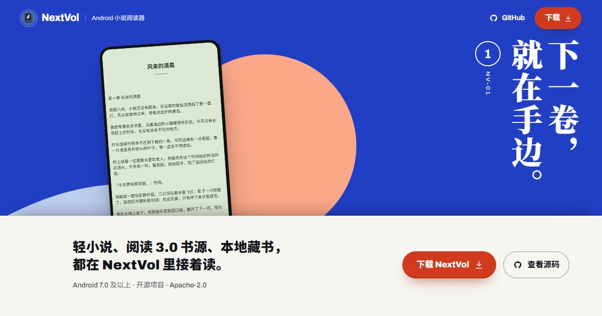

# NextVol 官网

[NextVol](https://github.com/Renakoni/nextvol)（Android 小说阅读器）的官网与下载页。



首页是一套「文库本」：每一屏是一卷，有竖排书名、真机截图和一条腰封。滚动、按方向键，或拖动左下角的书角，书页会用 WebGL 卷起，翻到下一卷。

## 页面

- `/`：七卷，依次是封面、自选来源、随时开听、自己的纸张、随身书库、后记、版权页。
- `/download/`：下载页，从 GitHub Releases 读取最新版本。发布里带有 `.apk` 时按钮直接下载，没有时前往发布页。不需要额外配置。

## 技术

- Astro 7（静态输出）、Tailwind CSS 4
- Three.js：翻页卷曲的着色器（`src/scripts/curl-webgl.ts`）。没有 WebGL 或只有软件渲染时，退回 CSS 折页（`curl-css.ts`）。
- GSAP：翻页的时间线
- 无后端，无统计脚本

## 本地开发

```bash
npm ci
npm run dev      # 开发服务器，默认 http://127.0.0.1:4321
npm run build    # 类型检查并构建到 dist/
npm run preview  # 预览构建结果
```

在 Node 24 上开发和测试。

## 部署

构建产物是纯静态的 `dist/`。Vercel、Netlify、Cloudflare Pages 等直接导入仓库即可：

- 构建命令：`npm run build`
- 输出目录：`dist`

图片和字体都用根路径（`/images/…`、`/fonts/…`）引用。如果部署在子路径下（例如没有自定义域名的 GitHub Pages，地址是 `/nextvolweb/`），需要先在 `astro.config.mjs` 里设置 `base`，并相应调整这些路径。

## 目录

```
src/
  pages/            index.astro（七卷）、download.astro（下载页）
  components/       Volume（一卷的书封与腰封）、Screen（截图版面）、Icon
  data/site.ts      卷名、书名、FAQ、内置音源等文案与数据
  scripts/          home.ts（翻页、书角拖动、目录、换纸）、curl-*.ts（翻页卷曲）、release.ts（下载页）
  styles/global.css
public/             字体子集、WebP 截图、字体许可
scripts/            prepare-fonts.mjs、prepare-assets.mjs、示例书生成脚本
evidence/product/   截图原图与原创示例书
DESIGN.md           设计系统：配色、字体、版式、动效与降级规则
```

## 修改内容时

- **改了中文文案**：运行 `node scripts/prepare-fonts.mjs`。字体文件只包含站内用到的字，新增的字不跑这一步会显示成系统字体。
- **换截图**：把原图放进 `evidence/product/captures/`，在 `scripts/prepare-assets.mjs` 里登记，然后运行 `node scripts/prepare-assets.mjs`，会生成 720px 和 440px 两档 WebP。截图里只出现原创示例书的内容。
- **内置音源**：第 3 卷的音色数量取自应用的内置音源库。应用更新音源时，同步修改 `src/data/site.ts` 里的 `voices`。
- 版式和动效的规则见 `DESIGN.md`。

## 降级

系统开启「减少动态效果」、浏览器没有 JavaScript，或窗口高度不足 520px 时，七卷改为普通的上下滚动页面，内容完整。

## 素材与许可

- 截图来自 NextVol 应用的实机运行；应用本身以 Apache-2.0 开源。
- 示例书《风经过的地方》《夜航信笺》《夏日慢行》《山海来信》的文字与封面为本项目原创，以 CC0 发布。
- 字体为 Archivo、Noto Sans SC、Noto Serif SC 的子集，使用 SIL Open Font License，许可全文见 `public/licenses/`。
